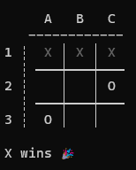
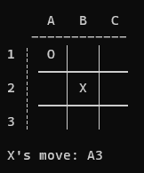

# Tic Tac Toe with computer players

Tic tac toe game in Python, built using [this tutorial](https://realpython.com/tic-tac-toe-ai-python/)

Implements the game and 3 player types:
- Human player
- Random player: A computer agent picking a move at random from all possible moves
- Minimax player: A computer agent picking moves based on the best outcome using the minimax algorithm. The first of 
the game is still picked at random.

## Setup

- Built and tested using Python 3.11
- The game is setup as a package,  
install in your environment as follows (note the forward slash - `/`):  
  `python -m pip install library/`  
  (Use the `--editable` flag during development)
- Requires only built-in packages, so there is no `requirements.txt`

## Play

In Windows:
- Open cmd
- Go to the `frontend` folder in the project
- Activate the Python environment
- run `python -m console --help` to see all options
- run `python -m console -X human -O minimax --starting X` to play against the computer
- Pass moves by combining the row-digit and column-letter, such as `A1` or `B3`

 